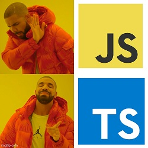

# My typescript patterns

Design patterns in typescript

- [x] [Composite](./src/composite.md)
- [x] [Constructor](./src/constructor.md)
- [x] [Decorator](./src/decorator.md)
- [x] [Facade](./src/facade.md)
- [x] [Factory](./src/factory.md)
- [x] [FlyWeight](./src/flyweight.md)
- [x] [Iterator](./src/iterator.md)
- [x] [Mediator](./src/mediator.md)
- [x] [Observer](./src/observer.md)
- [x] [Prototype](./src/prototype.md)
- [x] [Proxy](./src/proxy.md)
- [x] [Publish Subscribe](./src/publish-subscribe.md)
- [x] [Singleton](./src/singleton.md)
- [x] [Strategy](./src/strategy.md)
