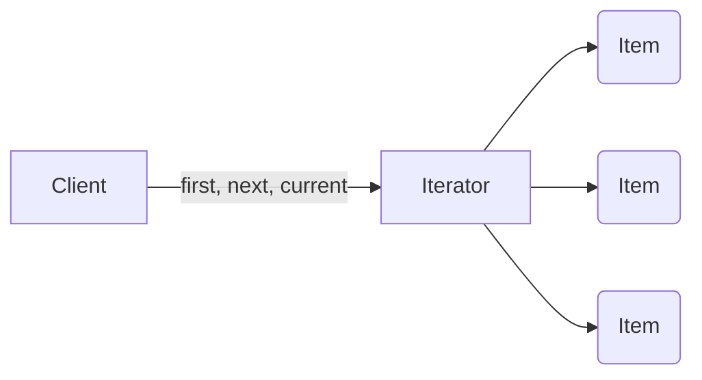

# Iterator

The Iterator pattern allows clients to effectively loop over a collection of objects.

## Using Iterator

A common programming task is to traverse and manipulate a collection of objects. These collections may be stored as an array or perhaps something more complex, such as a tree or graph structure. In addition, you may need to access the items in the collection in a certain order, such as, front to back, back to front, depth first (as in tree searches), skip evenly numbered objects, etc.

The Iterator design pattern solves this problem by separating the collection of objects from the traversal of these objects by implementing a specialized iterator.

Today, many languages have Iterators built-in by supporting `for-each`-type constructs and IEnumerable and IEnumerator interfaces. However, JavaScript only supports basic looping in the form of for, `for-in`, `while`, and `do while` statements.

The Iterator pattern allows JavaScript developers to design looping constructs that are far more flexible and sophisticated.

## Diagram

## Participan

The objects participating in this pattern are:

- `Client`: The run() function references and invokes Iterator with collection of objects
- `Iterator`: Implements iterator interface with methods first(), next(), etc keeps track of current position when
traversing collection.
- `Items`: Individual objects of the collection being traversed.

## See a code example

[Example](./iterator.ts)
