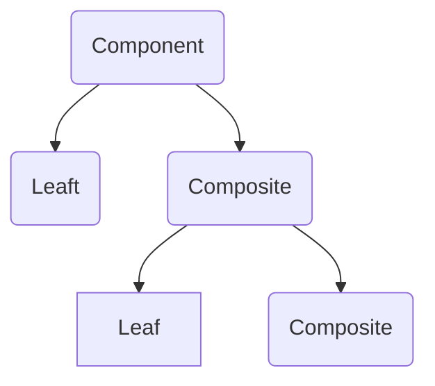

# The Composite pattern
The Composite pattern allows the creation of objects with properties that are primitive items or a collection of objects. Each item in the collection can hold other collections themselves, creating deeply nested structures.

## Using Composite

A tree control is a perfect example of a Composite pattern. The nodes of the tree either contain an individual object (leaf node) or a group of objects (a subtree of nodes).

All nodes in the Composite pattern share a common set of properties and methods which supports individual objects as well as object collections. This common interface greatly facilitates the design and construction of recursive algorithms that iterate over each object in the Composite collection

## See a code example

[Example](./composite.ts)
