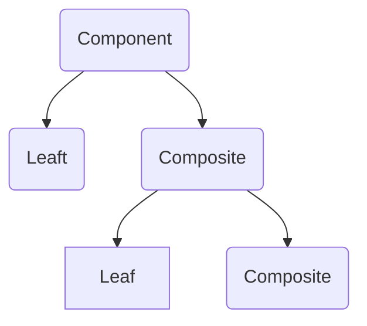

# El patron Composite

El patron Composite permite la creación de objetos con propiedades que son elementos primitivos o una coleccion de objetos. Cada elemento en la colección puede contener otras colecciones, creando estructuras profundamente anidadas.

## Usar el patron Composite

Un control de árbol es un ejemplo perfecto de un patron Composite. Los nodos del árbol contienen un objeto individual (nodo hoja) o un grupo de objetos (un sub árbol de nodos).

Todos los nodos en el patron Composite comparten un conjunto común de propiedades y métodos que admiten objetos individuales así como colecciones de objetos. Esta interfaz común facilita en gran medida el diseño y la construcción de algoritmos recursivos que iteran sobre cada objeto en la colección Composite.

## Diagrama de clases



## Ejemplo

```typescript
interface DomElement {
  render(): string;
}

class TagElement implements DomElement {
  private children: DomElement[] = [];

  private name: string;

  constructor(name: string) {
    this.name = name;
  }

  public appendChild(domElement: DomElement): void {
    this.children.push(domElement);
  }

  public render(): string {
    const children = this.children.map((child: DomElement) => child.render()).join('');
    return `<${this.name}>\n${children}</${this.name}>\n`;
  }
}

class TextElement implements DomElement {
  private text: string;

  constructor(text: string) {
    this.text = text;
  }

  public render(): string {
    return `${this.text}\n`;
  }
}

function render(domElement: DomElement) {
  console.log(domElement.render());
}

const body = new TagElement('body');
const div = new TagElement('div');
const label = new TagElement('label');
const text = new TextElement('Hello World');

label.appendChild(text);
body.appendChild(div);
body.appendChild(label);

render(body);

/*
  // Output:

  <body>
    <div>
    </div>
    <label>
      Hello World
    </label>
  </body>
*/
```

## Ver un ejemplo de código

[Example](./composite.ts)
