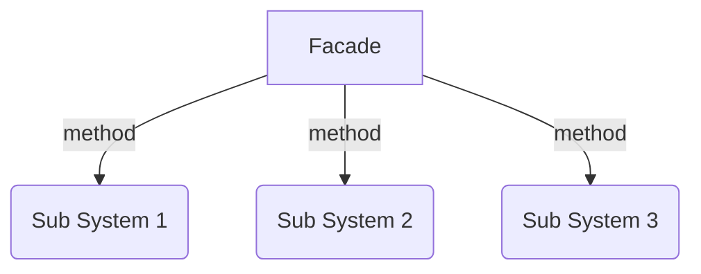

# The Facade Pattern

The Façade pattern provides an interface which shields clients from complex functionality in one or more subsystems. It is a simple pattern that may seem trivial but it is powerful and extremely useful. It is often present in systems that are built around a multi-layer architecture.

When you put up a facade, you're usually creating an outward appearance which conceals a different reality. The facade pattern provides a convenient higher-level interface to a larger body of code, hiding its true underlying complexity. Think of it as simplifying the API being presented to other developers.

This allows us to interact with the facade rather than the subsystem behind the scenes.

The reason the facade is of interest is because of its ability to hide implementation-specific details about a body of functionality contained in individual modules. The implementation of a module can change without the clients really even knowing about it.

As you can see, our module contains a number of methods which have been privately defined. A facade is then used to supply a much simpler API to accessing these methods.

## Using facade

The intent of the Façade is to provide a high-level interface (properties and methods) that makes a subsystem or toolkit easy to use for the client.

On the server, in a multi-layer web application you frequently have a presentation layer which is a client to a service layer. Communication between these two layers takes place via a well-defined API. This API, or façade, hides the complexities of the business objects and their interactions from the presentation layer.

Another area where Façades are used is in refactoring. Suppose you have a confusing or messy set of legacy objects that the client should not be concerned about. You can hide this code behind a Façade. The Façade exposes only what is necessary and presents a cleaner and easy-to-use interface.

Façades are frequently combined with other design patterns. Façades themselves are often implemented as singleton factories.

## Diagram

## See a code example
[Example](./facade.ts)
