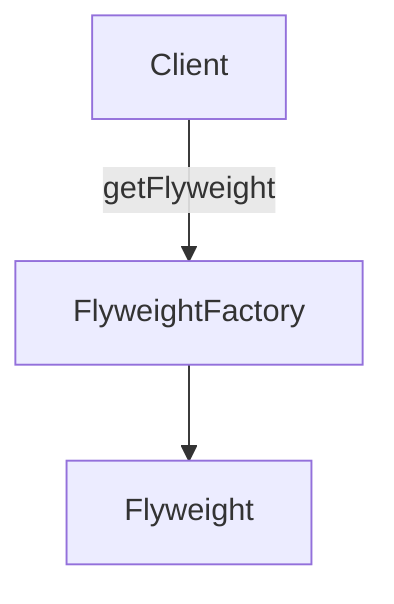

# Flyweight

The Flyweight pattern conserves memory by sharing large numbers of fine-grained objects efficiently. Shared flyweight objects are immutable, that is, they cannot be changed as they represent the characteristics that are shared with other objects.

## Use Flyweight

Essentially Flyweight is an `object normalization technique` in which common properties are factored out into shared flyweight objects. (Note: the idea is similar to data model normalization, a process in which the modeler attempts to minimize redundancy).

An example of the Flyweight Pattern is within the JavaScript engine itself which maintains a list of immutable strings that are shared across the application.

Other examples include characters and line-styles in a word processor, or `digit receivers` in a public switched telephone network application. You will find flyweights mostly in utility type applications such as word processors, graphics programs, and network apps; they are less often used in data-driven business type applications.

## Diagram

## Participants

The objects participating in this pattern are:

- `Client`: Calls into FlyweightFactory to obtain flyweight objects.
- `FlyweightFactory`: Creates and manages flyweight objects
if requested, and a flyweight does not exist, it will create one
stores newly created flyweights for future requests.
- `Flyweight` Maintains intrinsic data to be shared across the application.

## See a code example
[Example](./fly-weight%20.ts)
