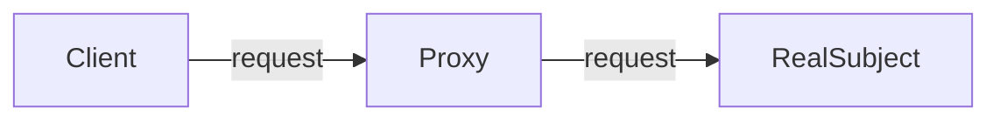

# The Proxy pattern

The Proxy pattern provides a surrogate or placeholder object for another object and controls access to this other object.

With a Proxy object, we get more control over the interactions with certain objects. A proxy object can determine the behavior whenever we're interacting with the object, for example when we're getting a value, or setting a value.

## Using proxy

In object-oriented programming, objects do the work they advertise through their interface (properties and methods). Clients of these objects expect this work to be done quickly and efficiently. However, there are situations where an object is severely constrained and cannot live up to its responsibility. Typically this occurs when there is a dependency on a remote resource (resulting in network latency) or when an object takes a long time to load.

In situations like these you apply the Proxy pattern and create a proxy object that ‘stands in’ for the original object. The Proxy forwards the request to a target object. The interface of the Proxy object is the same as the original object and clients may not even be aware they are dealing with a proxy rather than the real object

## Diagram

## Participants

The objects participating in this pattern are:

- `Client`: Calls Proxy to request an operation.
- `Proxy`: Provides an interface similar to the real object
maintains a reference that lets the proxy access the real object
handles requests and forwards these to the real object.
- `RealSubject`: Defines the real object for which service is requested.
