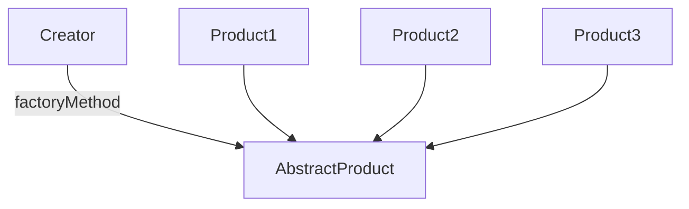

# Factory

A Factory Method creates new objects as instructed by the client. One way to create objects in JavaScript is by invoking a constructor function with the new operator. There are situations however, where the client does not, or should not, know which one of several candidate objects to instantiate. The Factory Method allows the client to delegate object creation while still retaining control over which type to instantiate, object instances are created by using a factory to make the required object for us.

Using the factory pattern gives us certain advantages:

- `Dynamic object creation`: It can be used in cases where the type of the object is decided at runtime.
- `Abstraction`: The user never really has to access the actual object’s constructor.
- `Reusability/Maintenance`: Same factories can be used for similar objects and it allows us to add/remove new object classes easily without changing a lot of code.

The key objective of the Factory Method is extensibility. Factory Methods are frequently used in applications that manage, maintain, or manipulate collections of objects that are different but at the same time have many characteristics (i.e. methods and properties) in common.

## Diagram

## Participants

The objects participating in this pattern are:

- `Creator`: The 'factory' object that creates new products
implements 'factoryMethod' which returns newly created products

- `AbstractProduct`: Not used in JavaScript
declares an interface for products

- `ConcreteProduct` The product being created
all products support the same interface (properties and methods)

## See a code example
[Example](./factory.ts)
