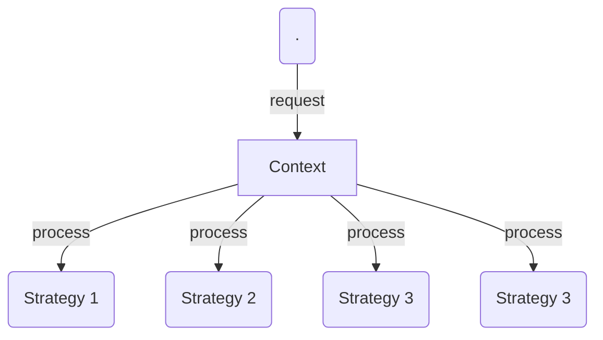

# Strategy

The Strategy pattern encapsulates alternative algorithms (or strategies) for a particular task. It allows a method to be swapped out at runtime by any other method (strategy) without the client realizing it. Essentially, Strategy is a group of algorithms that are interchangeable.

## Use strategy

Say we like to test the performance of different sorting algorithms to an array of numbers: shell sort, heap sort, bubble sort, quicksort, etc. Applying the Strategy pattern to these algorithms allows the test program to loop through all algorithms, simply by changing them at runtime and test each of these against the array. For Strategy to work all method signatures must be the same so that they can vary without the client program knowing about it.

In JavaScript the Strategy pattern is widely used as a plug-in mechanism when building extensible frameworks. This can be a very effective approach.

## Diagram

## Participants

- `Context`: Maintains a reference to the current Strategy object
supports interface to allow clients to request Strategy calculations
allows clients to change Strategy
- `Strategy`: Implements the algorithm using the Strategy interface

## See a code example
[Example](./strategy.ts)
